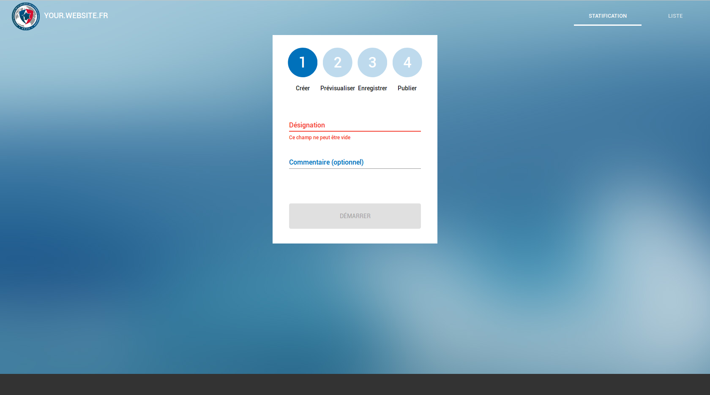
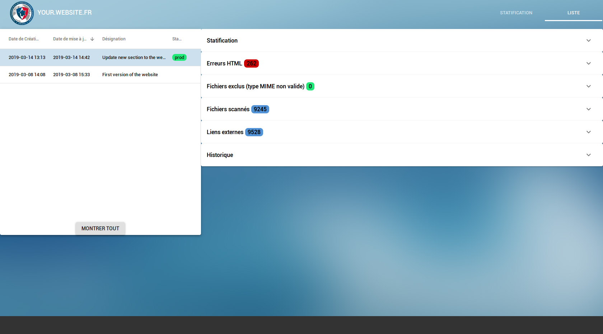

<div align="center">
  <h1>
    <br />
    
    <br />
    Cornetto

  </h1>
  Cool Open-Source Robust Nice and Easy Tightening Tool Online
  <br /><br />
    <h4>Free, open source tool to create and manage static version for any website.</h4>
  <h5>Available for Linux.</h5>
</div>

!!!Warning
This documentation is not finished, it's in the process of being written.

---

## Table of Contents <a name='table-of-contents'></a>

 - [Table of Contents](#table-of-contents)
 - [Screenshot](#screenshot)
 - [Features](#features)
 - [Contribute](#contribute)
 - [Example of installation](#example-of-installation)
 - [Settings](#settings)
 - [License](#license)

---

## Screenshot





## Features


  - Generate static versions from any dynamic website
  - Manage the previously generated static versions
      - Deploy them to your server
      - Visualize them

## Contribute

Cornetto requires **Python 3.x >= 3.4** .

The source of the application is divided into two folders


 - `back` - Python (Flask) source code for the API
 - `front` - JavaScript (React) source code for the user interface

If you want to contribute please feel free to fork and make pull requests.

## Backend API

The backend API is built with [Python][], it uses the [Flask][] framework and can be launched as a [WSGI][] application. You will find samples of both Cornetto and [Apache httpd][] configurations in the `back/cfg` folder.

##### Installation

 - Install the required package dependencies. If you want to use Apache to serve the API you will need `libapache2-mod-wsgi-py3`

```
# apt install libxml2 libxslt1.1 python3-lxml libimage-exiftool-perl libapache2-mod-wsgi-py3
```

 - Configure the virtual env and install Cornetto and its dependencies

```
/back/ $ python3 -m venv venv
/back/ $ . venv/bin/activate
/back/ $ pip3 install -e .
```

- Copy `back/cfg/conf.py` to the directory of your choice
    - We advise that it be `/etc/cornetto/conf.py`
    - Ensure the `create_app(/etc/cornetto/conf.py)` call in `wsgi.py` match that directory

```
/back/ # mkdir /etc/cornetto
/back/ # cp cfg/conf.py /etc/cornetto/conf.py
```

- Adapt `conf.py` to your needs. See [settings](#settings)

- Configure Apache to serve the API or use [Gunicorn][]
    - Example : launching the API with Gunicorn

```
/back/$ gunicorn -w 4 wsgi:application
[2019-04-12 17:18:57 +0200] [6439] [INFO] Starting gunicorn 19.7.1
[2019-04-12 17:18:57 +0200] [6439] [INFO] Listening at: http://127.0.0.1:8000 (6439)
[2019-04-12 17:18:57 +0200] [6439] [INFO] Using worker: sync
[2019-04-12 17:18:57 +0200] [6442] [INFO] Booting worker with pid: 6442
[2019-04-12 17:18:57 +0200] [6443] [INFO] Booting worker with pid: 6443
[2019-04-12 17:18:57 +0200] [6446] [INFO] Booting worker with pid: 6446
[2019-04-12 17:18:57 +0200] [6447] [INFO] Booting worker with pid: 6447

```

## Frontend

The web interface is built with [React][] and uses [react-scripts][].

##### Installation

- In the `front/` directory, install node dependencies by running

  ```
  /front/ $ npm install
  ```

- Create a production build by running

  ```
  /front/ $ npm run build
  ```
- It will create a `build/` folder that you can rename and copy to your webserver root directory.
  For example with the webserver root directory `/var/www`

  ```
  /front/ $ mv build/ cornetto_front/
  /front/ $ cp -r cornetto_front/ /var/www/
  ```

- If you only want to launch the front in development mode, run

  ```
  /front/ $ npm start
  ```

  - In development mode, make sure to launch the API first and to proxy API calls in `package.json`

    ```
      "proxy": "http://localhost:8000",
    ```

  - The default proxy set in `package.json` is intended to work with an API started with Gunicorn on port 8000

#### Frontend Customization

You might want to modify frontend parameters before building.


In file `/front/src/strings.js` you need to modify the line _159_ to _162_ to adapt the parameter to your needs.

```
url: {
  site_static: 'https://static.web.your-private-domain.com',
  site_visualize: 'https://visualize.web.your-private-domain.com',
  site_prod: 'https://web.com',
  name: 'web.com'
}
```

At line _594_ of file `/front/src/sagas/statifications.js` there is a condition that checks the maximum number of accepted HTML errors and Scrapy errors. The limit defaults to **500**, you might want to adjust this number to your needs.

```
593     // maximum number of errors accepted
594     if (result && (result.html_errors.length > 500 || result.scrapy_errors.length > 500)) {
```


## Installation walkthrough

This example of installation assumes that you are using Apache on a Debian-based server.

- Install the dependencies

  ```
  # apt install libxml2 libxslt1.1 python3-lxml libimage-exiftool-perl libapache2-mod-wsgi-py3
  ```

- `back/cfg/conf.py` contains all the settings of Cornetto, it should be placed in `/etc/cornetto/`

- The source of the API inside the `back` folder can be copied to `/opt/cornetto`

#### The files you will need to create

Those two folders will be served by a web server like Apache, so it is necessary that they have the correct permissions (example: `chown -R www-data:www-data`).

```
opt/
└── cornetto/
    ├── static/
    |   └── ... (website source)
    └── visualize/
        └── ... (website source)
```

Then you will need to copy the frontend build to an Apache document root folder. Usually we also set two symbolic links to the two folder `/opt/cornetto/static` and `/opt/cornetto/visualize`, this way everything is accessible in the same place.

```
├── web server root foler (example: /var/www/)
   ├── static -> /opt/cornetto/static
   ├── visualize -> /opt/cornetto/visualize
   └── frontend/
```

Then you will need to create the configuration file for each site.

```
sites-enabled configuration folder, exemple for Apache :
apache2/
└── sites-enabled/
    ├── static.web.your-private-domain.com-http
    ├── static.web.your-private-domain.com-https
    ├── statif.web.your-private-domain.com-http
    ├── statif.web.your-private-domain.com-https
    ├── visualize.web.your-private-domain.com-http
    └── visualize.web.your-private-domain.com-https
```

There are two configuration files, one for http requests (port 80) and one for https requests (port 443). The http configuration file should redirect to https.

There is one couple of configuration files for each site that should be served :

 - One for the folder that contains the source of the latest static version
 - One for the folder that contains the source of the visualized static version
 - One for the folder that contains the frontend of Cornetto


## Settings

### Configuring Cornetto

The file `/etc/cornetto/conf.py` contains all the configuration of Cornetto. You need to adapt the content to your setup.

## License
  Copyright (C) 2018–2019 ANSSI

  Contributors: 2018–2019 tech-sdn-app@ssi.gouv.fr

  This program is free software: you can redistribute it and/or modify
  it under the terms of the GNU General Public License as published by
  the Free Software Foundation, either version 3 of the License, or
  (at your option) any later version.
  This program is distributed in the hope that it will be useful,
  but WITHOUT ANY WARRANTY; without even the implied warranty of
  MERCHANTABILITY or FITNESS FOR A PARTICULAR PURPOSE. See the
  GNU General Public License for more details.

  You should have received a copy of the GNU General Public License
  along with this program. If not, see http://www.gnu.org/licenses/.

[Python]: https://python.org
[Flask]: https://github.com/pallets/flask
[WSGI]: https://wsgi.readthedocs.io
[Apache httpd]: https://httpd.apache.org
[Gunicorn]: https://gunicorn.org
[React]: https://reactjs.org
[react-scripts]: https://www.npmjs.com/package/react-scripts


